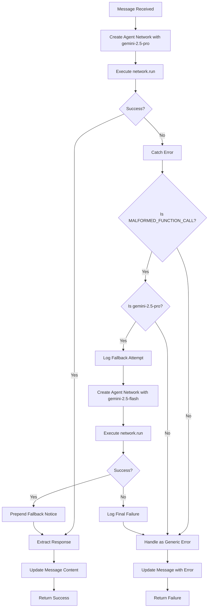

# Design Document: Gemini Malformed Function Call Fix

## Overview

This design implements a robust error detection and automatic model fallback mechanism to handle MALFORMED_FUNCTION_CALL errors from gemini-2.5-pro. The solution wraps the existing agent network execution in a try-catch block that detects specific error patterns and automatically retries with gemini-2.5-flash when appropriate.

The design follows these principles:
- Minimal changes to existing code structure
- Non-invasive error handling that preserves existing functionality
- Clear separation of concerns (error detection, retry logic, user feedback)
- Production-ready with comprehensive logging and error boundaries

## Architecture

### High-Level Flow



### Component Structure

The solution adds three new utility functions and modifies the main workflow:

1. **Error Detection Utility** (`isMalformedFunctionCallError`)
   - Inspects error objects for malformed function call patterns
   - Returns boolean indicating if error is a malformed function call

2. **Retry Logic** (inline in `processMessage`)
   - Wraps network.run in try-catch
   - Detects malformed function call errors
   - Recreates agent network with fallback model
   - Retries execution once

3. **User Feedback Formatter** (`formatFallbackNotice`)
   - Prepends user-friendly notice to successful fallback responses
   - Formats error messages for failed fallbacks

## Components and Interfaces

### 1. Error Detection Function

```typescript
interface ErrorDetectionResult {
  isMalformed: boolean;
  errorMessage?: string;
  errorDetails?: string;
}

function isMalformedFunctionCallError(error: unknown): ErrorDetectionResult {
  // Check if error is an Error object
  if (!(error instanceof Error)) {
    return { isMalformed: false };
  }

  const errorMessage = error.message.toLowerCase();
  const errorStack = error.stack?.toLowerCase() || "";
  
  // Check for explicit malformed function call indicators
  const hasMalformedKeyword = 
    errorMessage.includes("malformed_function_call") ||
    errorMessage.includes("malformed function call") ||
    errorStack.includes("malformed_function_call") ||
    errorStack.includes("malformed function call");
  
  // Check for malformed JSON patterns (commas at start of lines)
  const hasMalformedPattern = 
    errorMessage.includes(", \"") ||
    errorMessage.includes(",   \"") ||
    (errorMessage.includes("parameters:{") && errorMessage.includes(", "));
  
  if (hasMalformedKeyword || hasMalformedPattern) {
    return {
      isMalformed: true,
      errorMessage: error.message,
      errorDetails: error.stack,
    };
  }
  
  return { isMalformed: false };
}
```

### 2. Modified Process Message Workflow

The main change is wrapping the `network.run()` call in enhanced error handling:

```typescript
// First attempt with original model
let result: Awaited<ReturnType<typeof network.run>>;
let didFallback = false;

try {
  result = await network.run(agentInput);
} catch (error) {
  const malformedCheck = isMalformedFunctionCallError(error);
  
  // Only attempt fallback if:
  // 1. Error is malformed function call
  // 2. Current model is gemini-2.5-pro
  // 3. Provider is Google
  const shouldFallback = 
    malformedCheck.isMalformed &&
    modelSelection.provider === "google" &&
    modelSelection.model === "gemini-2.5-pro";
  
  if (shouldFallback) {
    // Log fallback attempt
    await step.run("log-fallback-attempt", async () => {
      console.warn("[process-message] Detected malformed function call, falling back to gemini-2.5-flash", {
        messageId,
        conversationId,
        originalModel: modelSelection.model,
        fallbackModel: "gemini-2.5-flash",
        errorMessage: malformedCheck.errorMessage,
      });
      
      try {
        await convex.mutation(api.system.createAgentEvent, {
          internalKey,
          projectId,
          conversationId,
          messageId,
          type: "listFiles",
          status: "warning",
          name: `Model fallback: gemini-2.5-pro → gemini-2.5-flash (malformed function call)`,
        });
      } catch {}
    });
    
    // Recreate agent network with fallback model
    const fallbackAgent = createAgent({
      name: "AutoDev",
      description: "An expert AI coding assistant",
      system: systemPrompt,
      model: getAgentKitModel(
        {
          provider: "google",
          model: "gemini-2.5-flash",
        },
        {
          temperature: 0.3,
          maxOutputTokens: Number.isFinite(CODING_MAX_OUTPUT_TOKENS)
            ? CODING_MAX_OUTPUT_TOKENS
            : 4096,
        }
      ),
      tools: [/* same tools as original */],
    });
    
    const fallbackNetwork = createNetwork({
      name: "AutoDev-network-fallback",
      agents: [fallbackAgent],
      maxIter: 20,
      router: ({ network }) => {
        const lastResult = network.state.results.at(-1);
        const hasTextResponse = lastResult?.output.some(
          (m) => m.type === "text" && m.role === "assistant"
        );
        const hasToolCalls = lastResult?.output.some(
          (m) => m.type === "tool_call"
        );
        if (hasTextResponse && !hasToolCalls) {
          return undefined;
        }
        return fallbackAgent;
      }
    });
    
    // Retry with fallback model
    try {
      result = await fallbackNetwork.run(agentInput);
      didFallback = true;
      
      // Log successful fallback
      await step.run("log-fallback-success", async () => {
        console.info("[process-message] Fallback to gemini-2.5-flash succeeded", {
          messageId,
          conversationId,
        });
      });
    } catch (fallbackError) {
      // Fallback also failed - handle as generic error
      await step.run("log-fallback-failure", async () => {
        const fallbackErrMsg = fallbackError instanceof Error 
          ? fallbackError.message 
          : String(fallbackError);
        
        console.error("[process-message] Fallback to gemini-2.5-flash also failed", {
          messageId,
          conversationId,
          originalError: malformedCheck.errorMessage,
          fallbackError: fallbackErrMsg,
        });
      });
      
      // Re-throw to be handled by existing error handling
      throw fallbackError;
    }
  } else {
    // Not a malformed function call or not gemini-2.5-pro - handle as before
    throw error;
  }
}

// Extract response (existing code)
const lastResult = result.state.results.at(-1);
const textMessage = lastResult?.output.find(
  (m) => m.type === "text" && m.role === "assistant"
);

let assistantResponse = "I processed your request. Let me know if you need anything else!";

if (textMessage?.type === "text") {
  assistantResponse =
    typeof textMessage.content === "string"
      ? textMessage.content
      : textMessage.content.map((c) => c.text).join("");
}

// Prepend fallback notice if we used fallback model
if (didFallback) {
  assistantResponse = formatFallbackNotice() + "\n\n" + assistantResponse;
}
```

### 3. User Feedback Formatter

```typescript
function formatFallbackNotice(): string {
  return "ℹ️ Note: I switched to a different model to complete your request successfully.";
}
```

## Data Models

No new data models are required. The solution uses existing data structures:

- **Error objects**: Standard JavaScript Error instances
- **Agent network results**: Existing @inngest/agent-kit result types
- **Message content**: Existing string-based message content

## Correctness Properties

*A property is a characteristic or behavior that should hold true across all valid executions of a system—essentially, a formal statement about what the system should do. Properties serve as the bridge between human-readable specifications and machine-verifiable correctness guarantees.*


### Property 1: Malformed Error Detection Accuracy

*For any* error object, the error detector should correctly identify it as malformed if and only if it contains "MALFORMED_FUNCTION_CALL" text or malformed JSON patterns (commas at line start), and should extract error details when detected.

**Validates: Requirements 1.1, 1.2, 1.3, 1.4**

### Property 2: Fallback Preserves Request Context

*For any* message input and system configuration, when the fallback mechanism is triggered, the retry should use the same message input, system prompt, and tool configurations as the original attempt.

**Validates: Requirements 2.2, 2.3**

### Property 3: Complete Error Logging

*For any* malformed function call error, the logging should include all required context (messageId, conversationId, projectId, model information, error message, and stack trace), and when fallback is initiated, should log both original and fallback model names.

**Validates: Requirements 3.1, 3.2, 3.3**

### Property 4: Fallback Notice Prepended

*For any* successful fallback execution, the final assistant response should begin with the fallback notice text.

**Validates: Requirements 4.1**

### Property 5: Non-Triggering Conditions

*For any* execution where the model is not gemini-2.5-pro OR the error is not a malformed function call OR no error occurs, the fallback logic should not be activated.

**Validates: Requirements 5.1, 5.2, 5.3**

### Property 6: All Error Paths Update Message

*For any* error that occurs during processing (including fallback errors), the workflow should eventually update the message content with appropriate error information or response.

**Validates: Requirements 6.4**

## Error Handling

### Error Categories

1. **Malformed Function Call Errors (Gemini 2.5 Pro)**
   - Detection: Check error message for "MALFORMED_FUNCTION_CALL" or malformed JSON patterns
   - Handling: Automatic fallback to gemini-2.5-flash
   - User feedback: Prepend notice to successful response
   - Logging: Log original error, fallback attempt, and outcome

2. **Fallback Execution Errors**
   - Detection: Error thrown during fallback network.run()
   - Handling: Treat as generic error, use existing error handling
   - User feedback: Standard error message with model suggestions
   - Logging: Log both original and fallback errors

3. **Generic Agent Errors**
   - Detection: Any error not matching malformed function call pattern
   - Handling: Existing error handling logic (unchanged)
   - User feedback: Standard error message
   - Logging: Standard error logging

4. **Logging/Infrastructure Errors**
   - Detection: Errors in createAgentEvent or updateMessageContent
   - Handling: Catch and continue (don't propagate)
   - User feedback: None (silent failure for infrastructure)
   - Logging: Console error only

### Error Boundaries

```typescript
// Primary error boundary (existing)
try {
  result = await network.run(agentInput);
} catch (error) {
  // Malformed function call detection and fallback
  if (shouldFallback) {
    try {
      // Fallback attempt
      result = await fallbackNetwork.run(agentInput);
    } catch (fallbackError) {
      // Fallback failed - propagate to existing error handling
      throw fallbackError;
    }
  } else {
    // Not malformed or not gemini-2.5-pro - propagate
    throw error;
  }
}

// Logging error boundaries (existing pattern)
try {
  await convex.mutation(api.system.createAgentEvent, {...});
} catch {
  // Silent failure - don't propagate
}
```

### Fallback Decision Matrix

| Condition | Model | Error Type | Action |
|-----------|-------|------------|--------|
| Error occurs | gemini-2.5-pro | MALFORMED_FUNCTION_CALL | Fallback to gemini-2.5-flash |
| Error occurs | gemini-2.5-pro | Other error | Standard error handling |
| Error occurs | gemini-2.5-flash | Any error | Standard error handling |
| Error occurs | OpenAI/Groq | Any error | Standard error handling |
| No error | Any model | N/A | Normal completion |

## Testing Strategy

### Dual Testing Approach

This feature requires both unit tests and property-based tests to ensure comprehensive coverage:

- **Unit tests**: Verify specific error scenarios, fallback flows, and edge cases
- **Property tests**: Verify universal properties across all error types and configurations

### Property-Based Testing

We will use **fast-check** (TypeScript property-based testing library) to implement property tests. Each property test will:
- Run a minimum of 100 iterations
- Generate random inputs (error objects, configurations, messages)
- Verify the property holds for all generated inputs
- Reference the design document property in a comment tag

**Tag format**: `// Feature: gemini-malformed-function-call-fix, Property {number}: {property_text}`

### Test Coverage

**Unit Tests:**
1. Error detection with explicit "MALFORMED_FUNCTION_CALL" text
2. Error detection with malformed JSON patterns
3. Error detection returns false for normal errors
4. Fallback triggered for gemini-2.5-pro with malformed error
5. Fallback not triggered for gemini-2.5-flash
6. Fallback not triggered for OpenAI/Groq models
7. Fallback not triggered for non-malformed errors
8. Successful fallback prepends notice to response
9. Failed fallback uses standard error handling
10. Logging includes all required fields
11. Infrastructure errors don't propagate
12. Message status updated on all error paths

**Property Tests:**
1. **Property 1**: Error detector correctly classifies all error types
2. **Property 2**: Fallback preserves all request context
3. **Property 3**: All malformed errors produce complete logs
4. **Property 4**: All successful fallbacks have notice prepended
5. **Property 5**: Non-triggering conditions never activate fallback
6. **Property 6**: All error paths update message

### Testing Configuration

```typescript
// fast-check configuration for property tests
const propertyTestConfig = {
  numRuns: 100, // Minimum iterations
  verbose: true,
  seed: Date.now(), // Reproducible with seed
};
```

### Mock Strategy

For testing the workflow, we'll need to mock:
- `network.run()` - to simulate success/failure scenarios
- `convex.mutation()` - to verify logging calls
- `createAgent()` and `createNetwork()` - to verify fallback agent creation
- Error objects - to test various error patterns

## Implementation Notes

### Key Design Decisions

1. **Single Retry Only**: The fallback logic attempts one retry with gemini-2.5-flash. If that fails, we use standard error handling. This prevents infinite retry loops and keeps the logic simple.

2. **Inline Fallback Logic**: The fallback is implemented inline in the processMessage function rather than as a separate utility. This keeps the context (step, internalKey, etc.) easily accessible and avoids complex parameter passing.

3. **Preserve Existing Error Handling**: The existing onFailure callback and error handling logic remain unchanged. The fallback logic only intercepts specific malformed function call errors.

4. **Silent Infrastructure Failures**: Errors in logging (createAgentEvent) don't propagate. This ensures that infrastructure issues don't break the user experience.

5. **User-Facing Feedback**: Successful fallbacks include a brief, non-technical notice. This transparency helps users understand why behavior might differ slightly.

### Configuration

The fallback model is currently hardcoded as "gemini-2.5-flash" but could be made configurable via environment variable:

```typescript
const FALLBACK_MODEL = process.env.AUTODEV_GEMINI_FALLBACK_MODEL ?? "gemini-2.5-flash";
```

### Performance Considerations

- The fallback adds one additional network.run() call only when malformed errors occur
- For successful gemini-2.5-pro executions, there is zero performance impact
- Error detection is fast (string matching only)
- Logging is async and doesn't block the main flow

### Future Enhancements

Potential improvements for future iterations:
1. Configurable fallback model via environment variable
2. Metrics collection on fallback frequency
3. Automatic model selection based on historical success rates
4. Retry with different temperature/parameters before model fallback
5. Circuit breaker pattern if fallback rate exceeds threshold
